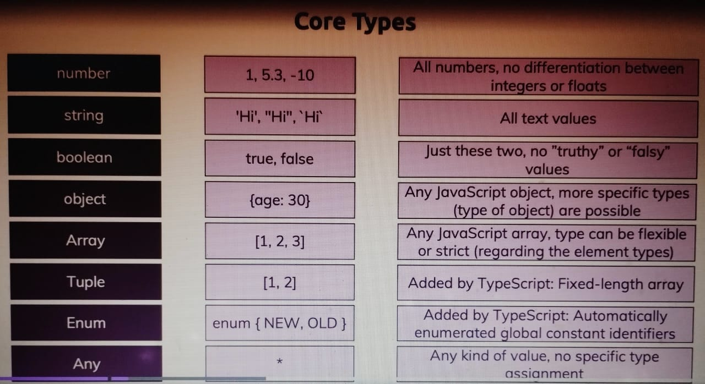

### Core Types

1. number (1,2,5,-66,5.6) 🔢
2. string ('Hi',"Hi",`Hi`) 🔡
3. boolean (true,false) ✔️/❌

- TS helps/checks/corrects us during development, unlike runtime err.
- JS🟡 uses "dynamic types" (resolved at runtime), TS🔵 uses "static types" (resolved during development).
  

```ts
// console.log('Your code goes here!!!...');
function add(n1: number, n2: number) {
	return n1 + n2;
}
//! no if-checks required 🥳

const number1 = 5;
const number2 = 2.5;

const result = add(number1, number2);
console.log(result);
```

- A bit more on core-types:

```ts
// console.log('Your code goes here!!!...');
function add(n1: number, n2: number, showResult: boolean, phrase: string) {
	if (showResult) {
		console.log(phrase, n1 + n2);
	} else {
		return n1 + n2;
	}
}

const number1 = 5;
const number2 = 2.5;
const printResult = true;
const resultPhrase = 'Result is:';

add(number1, number2, printResult, resultPhrase); //Result is: 7.5
```

Typescript has a built-in feature - TYPE-INFERENCE, but, it's a good practice to EXPLICITLY declare TYPES.

### Object Type{}

```ts
// const person: {
// 	name: string;
// 	age: number;
// }
// = {
// 	name: 'Skyy',
// 	age: 28,
// };

//! Better syntax, let it infer
const person = {
	name: 'Skyy',
	age: 28,
};

console.log(person.name);
```


### Array Type[ ]

```ts
const person = {
	name: 'Skyy',
	age: 28,
	hobbies: ['music🎸', 'reading📖', 'walking🚶🏻‍♂️'],
};

let favActivities: string[];
favActivities = ['music'];

//console.log(person.name);

for (const hobby of person.hobbies) {
	console.log(hobby.toUpperCase());
	//! hobby.map() ⚠️ Err.
}
```

### Working with TUPLES [ ]

Added by Typescript: Fixed-length array [ ].
Used when we know the length and/or the structure of our array beforehand.

```ts
const person: {
	name: string;
	age: number;
	hobbies: string[];
	role: [number, string]; //tuple: 1st element should be a number, 2nd element should be a string.
} = {
	name: 'Skyy',
	age: 28,
	hobbies: ['music🎸', 'reading📖', 'walking🚶🏻‍♂️'],
	role: [1, 'author'],
};

let favActivities: string[];
favActivities = ['music'];

person.role.push(`admin`);
//person.role[1] = 3; ⚠️
//push() is allowed in tuples (exception!)
//length/structure is enforced in tuples

console.log(person.role);
```

### Working with ENUMS

- First CUSTOM TYPE
  Loosely related to the idea of Tuples[ ], idea of having specific identifiers, global constants (but human readable type)

```ts
// const ADMIN = 0;
// const READ_ONLY =1;
// const AUTHOR = 2;

enum Role {
	ADMIN = 5,
	READ_ONLY,
	AUTHOR,
}
//! Behind the scenes/ By default => READ_ONLY = 7, AUTHOR = 7;
//! We can use any data type and even mix em up in Enums!
const person = {
	name: 'Skyy',
	age: 28,
	hobbies: ['music🎸', 'reading📖', 'walking🚶🏻‍♂️'],
	role: Role.ADMIN,
};

let favActivities: string[];
favActivities = ['music'];

if (person.role === Role.ADMIN) {
	console.log('is Admin!');
}
// O/P = is Admin!
```

### The 'ANY' type🔴⚠️

- Any takes away all the advantages of TS.
- Any should only be used as a FALLBACK when we don't have any idea about the data type.
- Even explicit inference is better than ANY

### Union Types ( | )

- When we combine different data types.

```ts
function combine(input1: number | string, input2: number | string) {
	let result; //because of scoping
	if (typeof input1 === 'number' && typeof input2 === 'number') {
		result = input1 + input2;
	} else {
		result = input1.toString() + input2.toLocaleString();
	}

	return result;
}

const combinedAges = combine(28, 33);
const combinedNames = combine('Skyy', 'Max');
console.log(combinedAges, combinedNames); //op: 61 SkyyMax
```

### Literal Types

- When we're sure/clear about a data type.
- Forcing a conversion

```ts
function combine(
	input1: number | string,
	input2: number | string,
	resultType: 'as-number' | 'as-txt', //! literal types combined with Union Types
) {
	let result; //because of scoping
	if (
		(typeof input1 === 'number' && typeof input2 === 'number') ||
		resultType === 'as-number'
	) {
		result = +input1 + +input2;
	} else {
		result = input1.toString() + input2.toString();
	}

	// if(resultType === 'as-number') {
	//     return +result;
	// }else{
	//     return result.toString();
	// }

	return result;
}

const combinedAges = combine(28, 33, 'as-number');
const combinedNames = combine('Skyy', 'Max', 'as-txt');
const combedStringAges = combine('28', '33', 'as-number');
console.log(combinedAges, combinedNames, combedStringAges);

//op- 61 'SkyyMax' 61
```

### Type Aliases/ Custom Types🎭

```ts
type Combinable = number | string; //Any name/type we want apart from JS reserved kws, ex- Date;
type ConversionAlias = 'as-number' | 'as-txt';

function combine(
	input1: Combinable,
	input2: Combinable,
	resultType: ConversionAlias, //! literal types combined with Union Types
) {
	let result; //because of scoping
	if (
		(typeof input1 === 'number' && typeof input2 === 'number') ||
		resultType === 'as-number'
	) {
		result = +input1 + +input2;
	} else {
		result = input1.toString() + input2.toString();
	}

	// if(resultType === 'as-number') {
	//     return +result;
	// }else{
	//     return result.toString();
	// }

	return result;
}

const combinedAges = combine(28, 33, 'as-number');
const combinedNames = combine('Skyy', 'Max', 'as-txt');
const combedStringAges = combine('28', '33', 'as-number');
console.log(combinedAges, combinedNames, combedStringAges);

//op- 61 'SkyyMax' 61
```


### Function Types( )

- Function Return Types & "void".
- We should use 'void' when there's no 'reteurn' statement.
- 'Undefined' is used when there's nothing/no value (void is better).

```ts
function add(n1: number, n2: number) {
	return n1 + n2;
}

function printResult(num: number): void {
	console.log(`Result: ` + num);
}
//let someValue: undefined;
printResult(add(5, 12));

//Syntax:
let combineVals: (a: number, b: number) => number;
/* 
☝🏻Function type. Now it says that 'combineVals' is a 
1) function 
2) Takes 2 arguments as "numbers" 
) The return value is a number 
*/
//! combineVals = 5; ⚠️ Type 'number' is not assignable to type 'Function'.
//! combineVals = printResult; ⚠️ Error! As structure does not match

//Function Types & CallBacks
function addAndHandle(n1: number, n2: number, cbfx: (num: number) => void) {
	const result = n1 + n2;
	cbfx(result);
}

combineVals = add;
console.log(combineVals(8, 4));
addAndHandle(10, 20, (res) => {
	console.log(res); //no need to define 'res' as already defined in the cbfx()
});
```

### The "unknown" type

We can store any values without getting errors.

```ts
let userInput: unknown;
let userName: string;

//No errors.
userInput = 5;
userInput = 'Skyy';

//! But..
//userName = userInput; ⚠️

//As unknown is not guaranteed to be a string
//If we switch userInput: unknown to userInput: any, the err. will go away
//'Any' is the most flexible type in TS (disables all type-checking)
//'unknown' is a bit stricter and better choice over 'any'
```

### Last but not the least: The 'never' type

- 'never' is another type function can return.

```ts
//For ex, an utility function that generates error objects/ throws error
function generateError(message: string, code: number): never {
	throw { message: message, errCode: code };
}
//It never returns a value as intended, it crashes/stops that part of the script.
//If not explicitly defined, TS infers it as 'void'.
//Another use case: fx throwing infinite loops

generateError(`An error occurred!`, 500);
```
